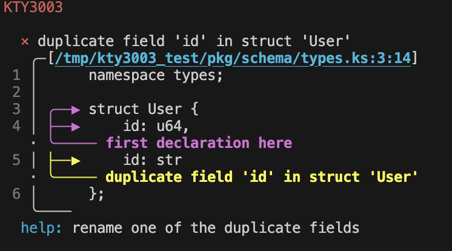

import { Card, CardGrid } from "@astrojs/starlight/components";

## Next steps

<CardGrid stagger>
  <Card title="Intro" icon="pencil">
    Learn more about `kintsu`
  </Card>
</CardGrid>

## Kintsu — a compact, expressive type schema language

Kintsu is a small, human-friendly language for defining schemas, operations, and typed contracts.
This site documents the syntax, the type system, and the design decisions behind the project.

<CardGrid stagger>
  <Card title="Get started" icon="rocket">
    <p>Read the quick overview and examples.</p>
    <p><a href="/syntax">Syntax</a> · <a href="/types">Types</a></p>
  </Card>

{" "}

<Card title="Reference & CLI" icon="terminal">
  <p>Command-line usage and reference docs.</p>
  <p>
    <a href="/reference/cli">CLI</a>
  </p>
</Card>

{" "}

<Card title="Design & Specs" icon="book-open">
  <p>RFCs, specs, and architecture decisions.</p>
  <p>
    <a href="/summary">Specs</a>
  </p>
</Card>

  <Card title="Contribute" icon="github">
    <p>Found a bug? Want to propose a change?</p>
    <p><a href="https://github.com/kintsu/kintsu">GitHub</a></p>
  </Card>
</CardGrid>

### Quick taste

A compact example to show Kintsu's flavour. The site includes syntax highlighting for `kintsu` sources.

```kintsu title="api.ks"
namespace demo;

struct User {
  id: i64,
  name: str,
  email: str
};

error UserError {
  NotFound { id: i64 }
};

#[err(UserError)]
operation get_user(id: i64) -> User!;
```


### Powerful composition

Kintsu shines with **union types** and **type expressions** for DRY, modular schemas.

```kintsu title="composition.ks" "User & Timestamps" "Partial[User, name | email]" "oneof"
namespace api;

// Reusable field groups
struct Timestamps {
  created_at: datetime,
  updated_at: datetime
};

struct User {
  id: i64,
  name: str,
  email: str
};

struct Success {
  data: str
};

struct NotFound {
  resource: str
};

// Union merges fields from both structs
type FullUser = User & Timestamps;
/*
  FullUser {
    id: i64,
    name: str,
    email: str,
    created_at: datetime,
    updated_at: datetime
  }
*/

// Type expressions derive new types
type UserPatch = Partial[User, name | email];

// Discriminated unions for responses
type Response = oneof Success | NotFound;
```

### Flexible serialization

Control how variants serialize with **tagging attributes**—match JSON-RPC, Serde, Protobuf, or use Kintsu's runtime type hints.

```kintsu title="tagging.ks" "#[tag(external)]" "#[tag(name" "type_hint"
namespace api;

struct Success {
  data: str
};

struct Error { code: i32, reason: str };

// External: { "success": { "data": "..." } }
#[tag(external)]
type ResponseA = oneof Success | Error;

// Internal: { "kind": "success", "data": "..." }
#[tag(name = "kind")]
type ResponseB = oneof Success | Error;

// Default: add @kintsu marker for runtime type identification / introspection
#[tag(type_hint)]
type ResponseC = oneof Success | Error;
```

### Derive with type expressions

Avoid manual duplication—**Pick**, **Omit**, **Partial**, **Exclude** transform types at compile time.

```kintsu title="derivations.ks" "Pick[User" "Omit[User" "Exclude[ApiResponse" "User::email"
namespace api;

struct User {
  id: i64,
  name: str,
  email: str,
  password_hash: str
};

struct Success {
  data: str
};

struct NotFound {
  resource: str
};

struct ServerError {
  code: i32
};

type UserSummary = Pick[User, id | name];
/*
  UserSummary { id: i64, name: str }
*/

type PublicUser = Omit[User, password_hash];
/*
  PublicUser { id: i64, name: str, email: str }
*/

type ApiResponse = oneof Success | NotFound | ServerError;

type SafeResponse = Exclude[ApiResponse, ServerError];
/*
  SafeResponse = oneof Success | NotFound
*/

// Field projection
type EmailType = User::email;  // str
```

### Wire format control

Define serialization formats at the schema level with **form attributes**—base64-encoded cursors, compressed payloads, complex number representations.

```kintsu title="forms.ks" "#[form(" "precision"
namespace api;

struct PaginatedBase {
  // Pagination cursor: JSON -> gzip -> base64
  #[form(base64 = gzip = json)]
  cursor: Cursor
}
// in transit: PaginatedBase { cursor: string }

struct Vector {
  // Complex number with polar form
  #[form(polar, precision = f64)]
  angle: complex,

  // 8-bit minifloat for ML weights
  #[form(e4m3)]
  weight: f8
}
// in transit: Vector { angle: { }, weight: <fp8 e4m3> }
```

### Rich Developer Experience

Kintsu prioritises developer experience with clear diagnostics, powerful tooling, and safety guarantees.



**Actionable error messages** pinpoint issues with source spans, related locations, and suggestions for fixes.

**Type introspection** lets you query dependencies, resolve type chains, and compute diffs between schema versions—catch breaking changes before they reach production.

**Versioning guarantees** enforce semver at publish time. Breaking changes are blocked automatically, protecting downstream consumers from runtime failures.

**Reproducible builds** via lockfiles ensure identical dependency trees across environments.

### Why Kintsu?

- **Concise syntax** for types, operations, and contracts
- **Composable** via unions (`&`, `&|`) and type expressions (`Pick`, `Omit`, `Partial`)
- **Flexible serialization** with configurable variant tagging and form attributes
- **Wire format control** for compression, encoding, and precision at schema level
- **Type introspection** to track dependencies across packages
- **Semver enforcement** blocks breaking changes at publish time
- **Rich diagnostics** with source spans and actionable suggestions
- **Specification-driven** development with readable RFCs

### Quick links

| Topic                           | Description                     |
| ------------------------------- | ------------------------------- |
| [Syntax](/syntax)               | Builtin types, tokens, keywords |
| [Types](/types)                 | Structs, enums, oneof, errors   |
| [Attributes](/types/attributes) | Form, err, and tag attributes   |
| [Specs](/specs)                 | RFCs, architecture decisions    |
| [CLI](/reference/cli)           | Command-line reference          |
| [Specs Summary](/summary)       | Top Level Published Specs       |
